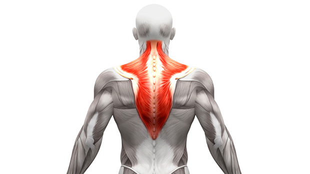

+++
title = "Smarter Because You Move"
date = 2020-09-23
weight = 2
+++

this is not something i would claim to people like “hey maybe if you could raise one eyebrow you would be smarter”, but control of your body is a nervous system process, which is reasonably considered relevant to intelligence. i happen to think that your nervous system is incredibly dumb. the amount of control i have over my body tells me that my brain is very bad at communicating with my body — it’s stupid. 

octopi are considered very smart, but they don’t use their nine brains to build computers, rather they can control each of their suction cups individually. that’s very impressive to me because here i am, a human controlling a metal machine that stores data and uses the internet and i can’t raise an eyebrow. 

“well that’s fine” you say, “why would you need to raise your eyebrow? it’s hard for you to isolate your other fingers, but you can move your thumbs with great control. your body is fine!”

to that, i shall share the tale of the trap muscle that won’t activate. if you don’t go to the gym, you might look at the muscle and think “how the fuck am I supposed to move that” and that would be a correct response. 

if you do weight lifting, then you might be thinking of specific exercises and how they target your low/mid/upper traps differently. you might still be unable to flex it without doing one of the exercises or without also tensing another muscle. 

if you’re me, you do a lot of hanging from your arms and inversions. you also do a lot of hunching over your computer and sticking your neck out. you have very strong shoulders and pec muscles (it’s side boob muscle) and a fairly weak neck. your traps are by no means weak because you need back muscles for many things. 

but then if you did one of those trap exercises, it’s so fucking hard! 

a fun thing with muscles, is that they do actually move and pull to exert force. that means if you press on it it, they can’t exert force. 

one day i was given a trap exercise and i said “noooo this is so hard”. then my pec muscle was pinched, and the trap exercise became easy, though for the first time ever i actually felt my trap working. 

what happened to my body was that my pecs were so used to doing all the work, that they would activate and kick in even when my traps should be doing the work — and would be better at the job. 

i went home with new exercises to really focus on learning to activate my traps — this is different from the intention of strengthening. i need to teach my traps to activate when they’re supposed to, and learn how to identify when my traps are activated vs when another part of my body is trying to take over. there are some exercises associated with this but the hard part really is teaching my body parts, nervous system and brain some new skills. 

as a software developer, i often assume that the default behaviour is ok when actually the default behaviour is dumb. in engineering this happens often because there are so many different use cases, but this is my BRAIN and my PEC they are literally right next to each other, grew up together, evolved to complement each other and they really should not be able to fuck up default behaviour. 

the extended narrative is that maybe the default behaviour was fine but i, as the engineer, fucked it up because i toggled it to custom behaviour by making my pecs work more, but a good (nervous) system should really emit some kind of warning to tell me i’m choosing to do something a stupid way. 

at the gut level, i feel dumb when my body doesn’t do what i want because it’s limited by the same mechanism that prevents me from calculating logarithms in my head (you can argue that this is wrong, but it feels that way). i would like to explore if these skills are transferable or if i will “feel smart” when i learn to activate my traps or isolate different parts of my abs. 
